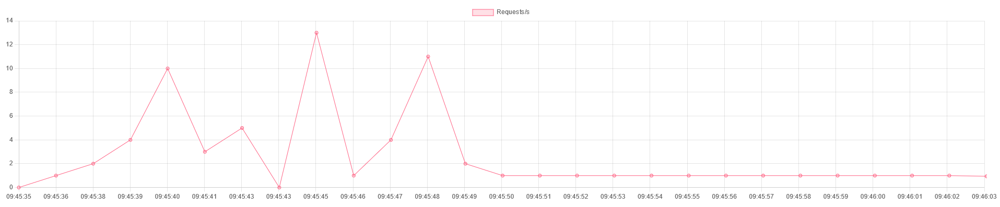

# nginx-monitoring
A simple flask app that displays stats from your nginx servers stub_status page.
## Currently shown stats
- [x] Requests/s
- [ ] Connections
- [ ] Reading
- [ ] Waiting
- [ ] Writing
## How it works
For this tool to work, you need to enable the stub_status page of
your nginx server. To do so, add following lines to your nginx
server config, usually located at /etc/nginx/nginx.conf
```
location = /basic_status {
    stub_status;
}
```
If you visit this location in browser, you will see an output
something like this:
```
Active connections: 291
server accepts handled requests
 16630948 16630948 31070465
Reading: 6 Writing: 179 Waiting: 106
```
This tool takes the data from this page and puts them into **nice
looking charts.**

## Setup
Make sure you have docker installed and configured correctly
1. ```docker build . -t nginx-monitoring```
2. ```docker run -p 5000:5000 --env STATUS_URL=https://yourwebsite.com/basic_status nginx-monitoring```
Make sure to replace https://yourwebsite.com/basic_status with your stub_status url.
